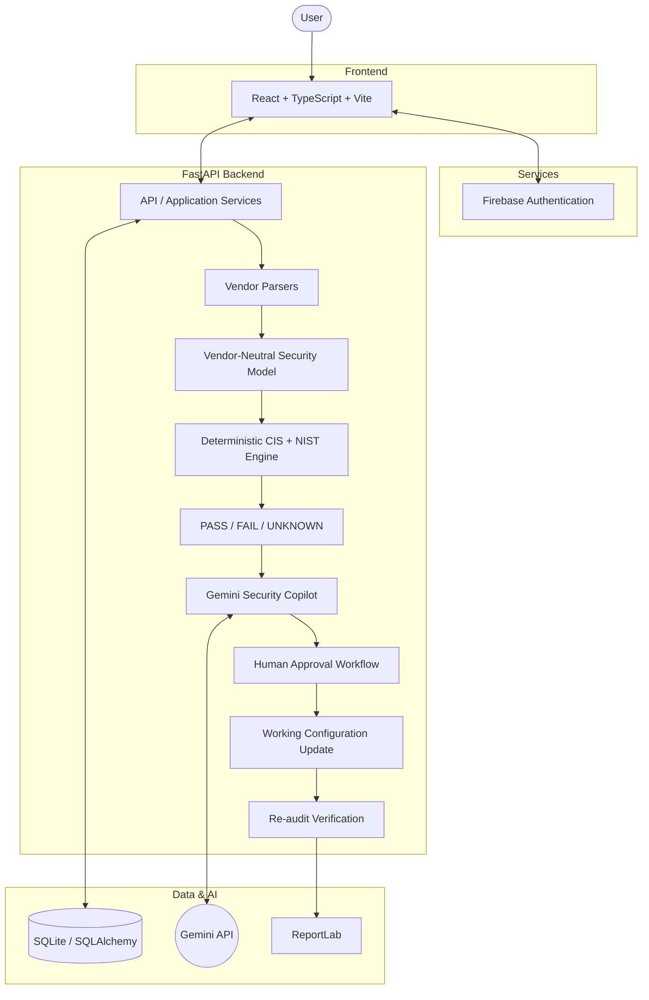

# NetSecure AI — AI-Driven Multi-Vendor Network Security Compliance Auditor

**SIH26155**

* Network configuration compliance auditing is traditionally a manual, error-prone, and vendor-specific process.
* Evaluating multi-vendor configurations against standardized frameworks (CIS, NIST) requires deep, vendor-specific expertise.
* Identifying and remediating non-compliant controls at scale is slow and complex without intelligent automation.
* NetSecure AI solves this by combining deterministic rule-based auditing with AI-assisted review and remediation.

---

## 2. Solution Overview

NetSecure AI provides an automated pipeline for enterprise network security compliance:

Configuration file  
↓  
Vendor detection  
↓  
Vendor-specific parsing  
↓  
Vendor-neutral normalization  
↓  
Deterministic compliance evaluation  
↓  
PASS / FAIL / UNKNOWN  
↓  
Gemini AI security copilot  
↓  
Human review / approval  
↓  
Remediation  
↓  
Re-audit / verification  
↓  
Learning through approved mappings  

**AI assists. Deterministic rules decide. Human approval controls changes. Re-audit verifies the result.**

---

## 3. Key Features

* Multi-vendor configuration auditing
* Cisco IOS / IOS-XE support
* Fortinet FortiOS support
* Palo Alto PAN-OS support
* Juniper Junos support
* Aruba AOS-CX support
* Check Point Gaia support
* CIS compliance evaluation
* NIST SP 800-53 mappings
* PASS / FAIL / UNKNOWN classification
* Gemini-assisted finding review
* Batch Gemini review
* AI remediation recommendations
* Manual remediation
* Human approval workflow
* Re-audit verification
* Unknown command analysis
* Training Center / approved mappings
* Approval history
* PDF reports
* Firebase authentication

---

## 4. Architecture



---

## 5. Technology Stack

| Layer          | Technology                   | Purpose                       |
| -------------- | ---------------------------- | ----------------------------- |
| Frontend       | React + TypeScript + Vite    | Web application               |
| Styling        | Tailwind CSS                 | Responsive enterprise UI      |
| Backend        | Python + FastAPI             | API and application services  |
| Server         | Uvicorn                      | ASGI server                   |
| AI             | Google Gemini                | AI-assisted security analysis |
| Validation     | Pydantic                     | Structured AI/API data        |
| Database       | SQLite + SQLAlchemy          | Application data              |
| Authentication | Firebase Authentication      | User authentication           |
| Reporting      | ReportLab                    | PDF reports                   |
| Testing        | Pytest                       | Backend verification          |

---

## 6. Compliance

### Currently implemented deterministic compliance
* **CIS**
* **NIST SP 800-53**

NetSecure AI evaluates supported network-security controls using deterministic rules. The architecture is extensible to additional control packs such as DISA STIG and ISO 27001 in the future.

---

## 7. AI Workflow

### Finding review

FAIL/UNKNOWN finding  
↓  
Gemini analyzes finding context  
↓  
Structured recommendation  
↓  
User reviews recommendation  
↓  
Approve / Edit / Reject  
↓  
If approved, remediation is applied to the working configuration  
↓  
Deterministic re-audit  
↓  
Result verified  

---

## 8. Learning / Training Center

Unknown command  
↓  
Gemini analyzes command  
↓  
Suggested normalized parameter / interpretation  
↓  
Administrator reviews  
↓  
Approve / Edit / Reject  
↓  
Approved mapping stored  
↓  
Future audits can reuse the approved mapping  

Invalid or uncertain mappings require administrator validation.

---

## 9. Security

* **Firebase authentication**: Protects the web application and verifies identity.
* **Backend verification of Firebase ID tokens**: API routes are securely protected.
* **Gemini API key stored server-side**: Never exposed to the client.
* **Firebase Admin service account stored server-side**: Securely handles backend admin tasks.
* **Environment variables for secrets**: Secure injection via `.env`.
* **Frontend does not receive Gemini API credentials**.
* **Backend authorization for sensitive operations**.
* **Input validation**: Enforced by Pydantic.
* **Safe configuration-file handling**: Local ephemeral storage.
* **CORS restrictions for deployment**: Handled by FastAPI settings.
* **Sensitive files excluded from Git**: Standard `.gitignore` applied.
* **No secrets committed to repository**.

---

## 10. Project Structure

```text
├── backend/
│   ├── app/
│   │   ├── api/
│   │   ├── core/
│   │   ├── db/
│   │   ├── models/
│   │   ├── schemas/
│   │   └── services/
│   └── tests/
└── frontend/
    ├── src/
    │   ├── app/
    │   ├── components/
    │   ├── contexts/
    │   ├── pages/
    │   ├── services/
    │   └── styles/
    └── index.html
```

---

## 11. Installation / Setup

### Prerequisites
* Python 3.11+
* Node.js (v18+) and npm
* A Firebase Project (with Authentication enabled)
* A Google Gemini API Key

---

## 12. Backend Setup

```bash
cd backend
python -m venv .venv
# On Windows: .venv\Scripts\activate
# On Mac/Linux: source .venv/bin/activate
pip install -r requirements.txt
# Configure .env based on .env.example
python -m uvicorn app.main:app --host 127.0.0.1 --port 8000
```

---

## 13. Frontend Setup

```bash
cd frontend
npm install
npm run dev
```

---

## 14. Environment Variables

**Backend (`backend/.env`) - SECRETS:**
* `ENVIRONMENT`
* `GEMINI_API_KEY` (Required for AI features)
* `FIREBASE_CREDENTIALS` (Service account JSON string, or path via `FIREBASE_SERVICE_ACCOUNT_PATH`)

**Frontend (`frontend/.env`) - PUBLIC:**
* `VITE_FIREBASE_API_KEY`
* `VITE_FIREBASE_AUTH_DOMAIN`
* `VITE_FIREBASE_PROJECT_ID`
* `VITE_FIREBASE_STORAGE_BUCKET`
* `VITE_FIREBASE_MESSAGING_SENDER_ID`
* `VITE_FIREBASE_APP_ID`

---

## 15. Running the Application

* **Backend Development Server**: `http://127.0.0.1:8000`
* **Frontend Development Server**: `http://localhost:5173`

*(Note: These are local development URLs only.)*

---

## 16. Testing

```bash
cd backend
python -m pytest tests/
```
Currently passing 75/75 deterministic and orchestration tests.

---

## 17. Build

```bash
cd frontend
npm run build
```
Currently passing with 0 errors (produces production `/dist`).

---

## 18. Usage

1. Sign in via Firebase Authentication
2. Start a configuration audit
3. Upload network configuration file
4. System detects vendor
5. Configuration is parsed
6. Compliance is evaluated
7. Findings are displayed
8. Gemini reviews eligible findings
9. User reviews proposed remediation
10. User approves/rejects/edits
11. Configuration is updated
12. System re-audits
13. PDF report can be generated

---

## 19. Current Scope / Limitations

* Current MVP is configuration-file based.
* It does not directly execute commands on physical network devices.
* Gemini availability depends on API quota/service availability.
* Deterministic compliance coverage currently focuses on implemented CIS and NIST mappings.
* STIG/ISO control packs are extensible/future scope.

---

## 20. Future Scope

* Live network-device collection
* Continuous compliance monitoring
* Configuration drift detection
* Expanded STIG/ISO control packs
* Additional vendors
* SIEM/SOAR integration
* Enterprise deployment
* Controlled live remediation
* Expanded compliance coverage
