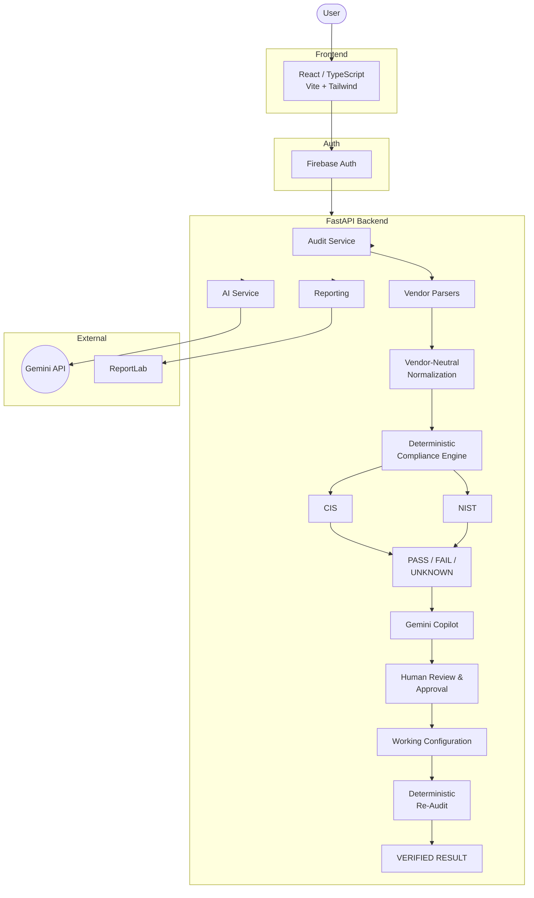
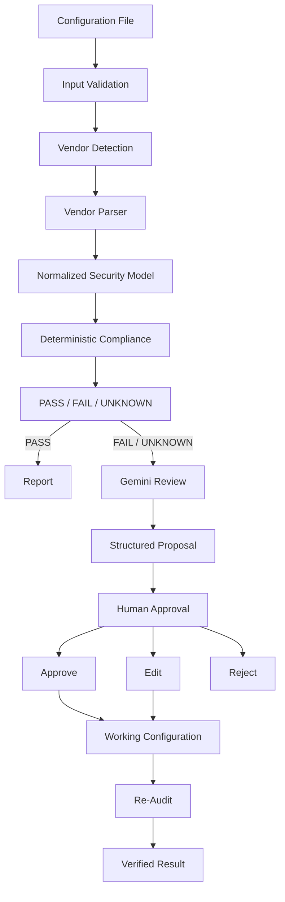

# NETSECURE AI — SYSTEM ARCHITECTURE
### AI-Driven Multi-Vendor Network Security Compliance Auditor | SIH26155

## System Architecture

## Component Description

### Frontend
React + TypeScript + Vite provides the responsive enterprise security interface.

### Backend
FastAPI handles authentication-aware APIs, auditing, compliance, remediation, AI orchestration and reporting.

### Parser Layer
Vendor-specific parsers convert heterogeneous network configurations into a normalized security representation.

### Compliance Engine
Deterministic rules evaluate implemented CIS and NIST controls.

### AI Layer
Gemini provides contextual explanation, remediation assistance and unknown-command analysis.

### Data Layer
SQLAlchemy with SQLite stores audits, findings, mappings and approval history.

### Authentication
Firebase Authentication provides user identity and backend token verification.

---
*(Page Break)*

# NETSECURE AI — DATA FLOW & SECURITY MODEL

## Data Flow

## Security Principles

* **Backend-only secrets**: Gemini API credentials and Firebase Admin credentials never enter the frontend bundle.
* **Authenticated APIs**: Sensitive backend operations require verified Firebase authentication.
* **Human-controlled remediation**: AI does not directly execute arbitrary network commands.
* **Deterministic authority**: Compliance decisions are based on deterministic rules where supported.
* **Structured AI output**: AI responses are validated before being used by application logic.
* **Re-audit verification**: Approved changes are re-evaluated rather than assuming that a proposed fix succeeded.
* **Safe learning**: Unknown-command mappings require administrator validation before becoming authoritative.

## Current Implementation

**Vendors**: Cisco IOS / IOS-XE, Fortinet FortiOS, Palo Alto PAN-OS, Juniper Junos, Aruba AOS-CX, Check Point Gaia  
**Deterministic Frameworks**: CIS, NIST SP 800-53  
**AI**: Google Gemini  
**Authentication**: Firebase Authentication  
**Reporting**: PDF / ReportLab  

## Future Extension
STIG / ISO 27001 control packs, Live device collection, Continuous compliance, Configuration drift detection, SIEM/SOAR integration, Controlled live remediation.
